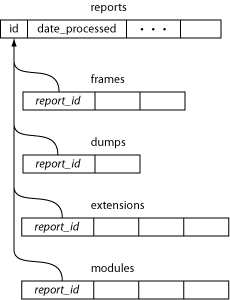
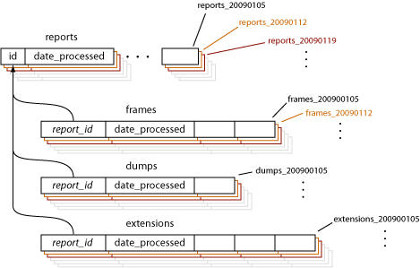

.. index:: databasepartitioning

.. _databasepartitioning-chapter:

Database Partitioning
=====================

The Socorro project's database schema is relatively simple. Five
tables house orders of magnitude more data than any other tables in
the system. These five tables, not particularly well normalized, were
inherited from the original version of this system.

These tables were originally partitioned to help ease the load.
Unfortunately, they were not partitioned correctly as the constraint
exclusion had subtly overlapping ranges. The creation of new
partitions was a manually invoked process that took many hours to
complete during which time the database system had to be offline. As
such, this step was neglected and the existing single partition became
very large. Finally, even if new partitions had been created in a
timely manner, it was thwarted by the omission of turning on
constraint exclusion in the server.

In the original partitioning scheme, the primary table 'reports' was
partitioned by insertion date. This was the natural column on which to
key the partitioning. The auxiliary tables, 'frames', 'dumps',
'extensions', and 'modules' (since deprecated), were partitioned by
range of their foreign key to the 'reports' table. This was subtly
incorrect because of there could not be a guaranteed one to one
relationship between date ranges of the reports tables and id ranges
of the other tables.

In my reformation of the partitioning scheme, I modified the schema
slightly so that each table contained the date column on which
partitioning keyed. While this was a step further away from
normalization, I felt it was appropriate to keep the partitioning code
simple and maintainable. Each table exercises the same code to
accomplish the partitioning. All the tables are partitioned in
parallel: a new 'reports' partition automatically means the other
tables are also have new partitions.

Unlike the original scheme for partitioned tables, the new scheme
keeps all indexes and constraints in terms of the child tables rather
than involving the parent tables. For example, the 'dumps' partition
for week one has a foreign key constraint to the 'reports' partition
for week one. Each child table holds its own indexes while none exist
on the parent tables.

The new partitioning scheme sets up new partitions on a weekly basis.
The cut off date between partitions is the transition between Sunday
night and Monday morning. Partitions are named with the parent table
name followed by the date of the Monday of the partition. The first
partition of 2009 for the reports table would be named
'reports_20090105' because the first Monday of the month was on the 5th.

New partitions can happen automatically. The agents that insert data,
do so by figuring out the name of the table to insert to based on the
date on which they're acting. An agent attempting to insert a new row
into 'reports' on Tuesday, January 27, 2009 will insert to
'reports_20090126'. If the insert fails because the table does not
exist, then the agent will roll back its insertion transaction and
attempt to create table within an independent transaction. This
transaction could fail because another agent is, perhaps, also trying
to create the same table. One agent will succeed while any others will
fail. Regardless of the outcome of the table creation transaction, the
agent will retry its insert.

It is also possible to run a cron task that creates new partitions
before they are needed. This would be somewhat more efficient. We
intend to leave the automatic creation code in place as a suspenders
AND belt technique.
